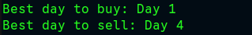

# stock-picker
An implementation of a method that takes in an array of stock prices, one for each hypothetical day and returns a pair of days representing the best day to buy and the best day to sell. Days start at 0.

### Check it out yourself

If you've got Ruby installed on your local machine, you can either

- Copy the contents of the script, `stock_picker.rb`, and paste it into the Interactive Ruby Shell (IRB) from the command line.

OR

- Run the script, using
    ```
    ruby stock_picker.rb
    ```
    from your command line.

Otherwise, you can just paste the contents into any Ruby REPL online.

### Screenshot

Here's a usage example where the `stock_picker` method was called with:

```
some_days = [17,3,6,9,15,8,6,1,10]

result = stock_picker(some_days)
```

